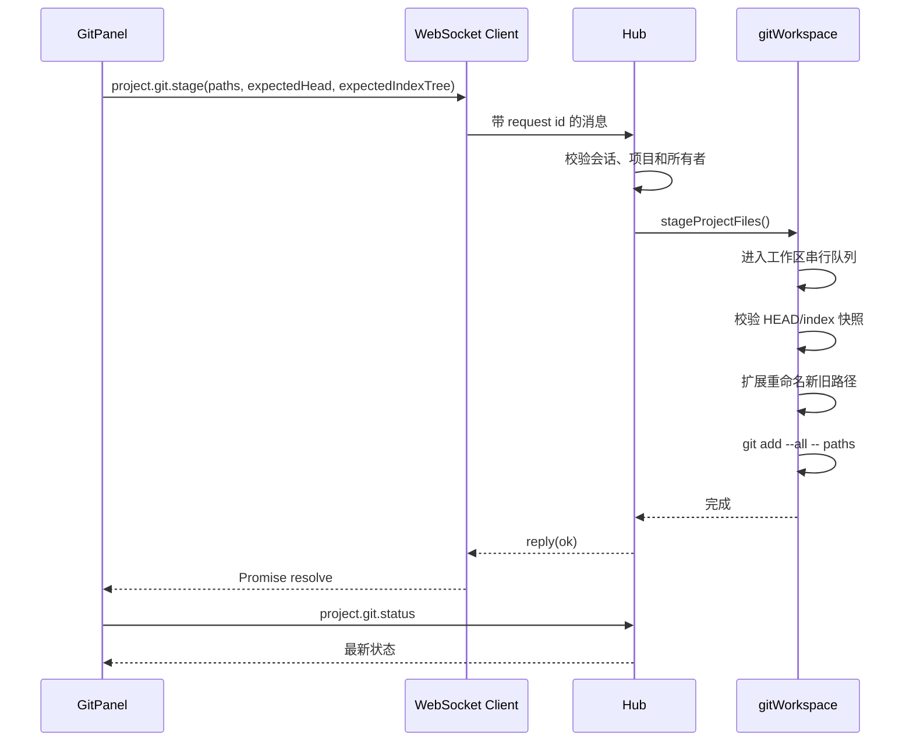
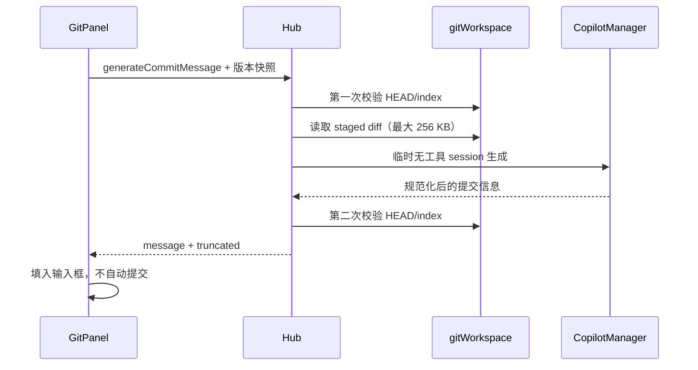
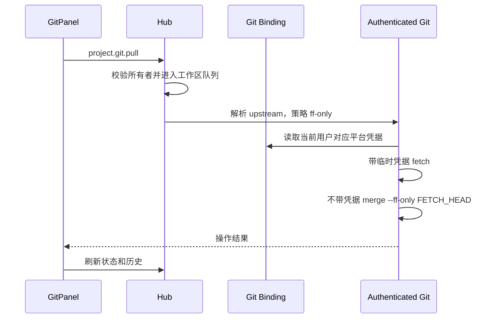

# 工作区面板 Git Client 实现解析

本文解析右侧工作区面板中 Git Client 的当前实现，覆盖前端交互、WebSocket 协议、服务端 Git 命令封装、提交历史图、差异渲染、认证远程操作以及 AI 提交信息生成。

> 文档对应当前仓库代码。这里的 “Git Client” 指应用内的 Git 图形面板，不是一个独立的 Git 命令行客户端。

## 1. 功能范围

右侧面板的“差异”页签由 `GitPanel` 提供，目前支持：

- 查看分支、上游分支以及 ahead/behind 状态。
- 区分已暂存和未暂存文件状态。
- 按文件暂存、取消暂存，以及批量暂存、取消暂存。
- 查看已暂存或工作区中的单文件 diff。
- 输入提交说明并提交当前已暂存更改。
- 根据当前已暂存 diff 生成提交信息，但不会自动提交。
- 拉取和推送 GitHub/Gitee 远程仓库。
- 搜索、分页查看提交历史。
- 绘制提交拓扑图并查看单个提交的完整 diff。
- 在统一 diff、左右分栏和自动换行之间切换。

当前面板没有提供丢弃更改、解决冲突、切换分支、变基、cherry-pick、revert、amend 或强制推送等操作。

## 2. 整体架构

Git Client 分为四层：

```text
RightPanel / GitPanel
        │
        │ WebSocket request + reply
        ▼
packages/protocol
        │
        ▼
Hub 路由与权限校验
        │
        ├── gitWorkspace.ts  本地状态、日志、diff、暂存
        ├── gitOperations.ts 提交和认证远程操作
        ├── gitBindings.ts   GitHub/Gitee 凭据绑定
        └── copilot.ts       AI 提交信息生成
```

主要设计原则：

1. `packages/protocol` 是前后端 Git 消息与领域类型的单一事实来源。
2. 浏览器不直接执行 Git，也不会接触远程访问令牌。
3. 服务端通过 `execFile("git", args)` 传递参数，不拼接 Shell 命令。
4. 写操作以工作区为单位串行执行，并通过 HEAD/index 快照拒绝过期操作。
5. 所有远程认证都从当前用户绑定的 GitHub/Gitee 凭据中临时注入。

## 3. 关键文件

| 文件 | 职责 |
| --- | --- |
| `apps/web/src/components/RightPanel.tsx` | 在右侧面板“差异”页签挂载 `GitPanel`，计算是否可编辑 |
| `apps/web/src/components/workspace/GitPanel.tsx` | Git 状态、历史、暂存、提交、同步和 AI 生成的主要 UI |
| `apps/web/src/components/workspace/DiffViewer.tsx` | 解析并渲染 patch，支持统一/分栏、折叠和换行 |
| `apps/web/src/lib/gitGraph.ts` | 将提交父子关系转换为泳道布局 |
| `apps/web/src/lib/client.ts` | WebSocket 请求 ID、响应匹配、超时和断线处理 |
| `apps/web/src/components/workspace/workspace.css` | Git 面板和历史页响应式布局 |
| `packages/protocol/src/index.ts` | Git 领域类型和 `project.git.*` 消息定义 |
| `apps/server/src/hub.ts` | WebSocket 路由、项目/会话归属校验和操作编排 |
| `apps/server/src/gitWorkspace.ts` | 状态、日志、提交 diff、文件 diff、暂存和版本控制 |
| `apps/server/src/gitOperations.ts` | 创建提交及认证的 clone/fetch/pull/push |
| `apps/server/src/gitBindings.ts` | GitHub/Gitee 令牌验证、加密保存和读取 |
| `apps/server/src/workspace.ts` | 拉取目标解析等通用工作区 Git 能力 |
| `apps/server/src/copilot.ts` | 使用隔离 Copilot session 生成提交信息 |

## 4. 前端入口与权限表现

`RightPanel` 把 `diff` 页签映射到 `GitPanel`：

```tsx
<GitPanel
  projectId={projectId}
  threadId={threadId}
  editable={thread?.access === "owner"}
/>
```

`editable` 只控制前端是否展示或启用写操作：

- 所有者可以暂存、提交、拉取和推送。
- 非所有者只会得到只读外观。
- 服务端仍会独立校验权限，前端隐藏按钮不是安全边界。

服务端的实际规则更严格：

- `requireOwnedProject()`：项目必须属于当前登录用户。
- `requireOwnedThreadProject()`：当前用户必须是会话所有者，会话必须关联请求中的项目，项目也必须属于该用户。
- 状态、日志和 diff 使用 `requireOwnedProject()`。
- 暂存、取消暂存、提交、AI 生成、拉取和推送使用 `requireOwnedThreadProject()`。

## 5. WebSocket 请求模型

前端所有 Git 操作都通过 `request()` 发送。`request()` 会：

1. 生成递增的 `req-N` 请求 ID。
2. 把请求写入 `pending` Map。
3. 发送 `{ ...message, id }`。
4. 收到同 ID 的 `reply` 后 resolve 或 reject。
5. WebSocket 断开时拒绝全部未完成请求。
6. 对显式传入 `timeoutMs` 的请求设置超时。

AI 生成使用 70 秒前端超时，拉取/推送使用 130 秒超时；普通状态和 diff 请求当前没有额外的前端定时器，但服务端 Git 子进程有自己的执行超时。

### 5.1 Git 请求一览

| 请求类型 | 主要参数 | 返回值 | 用途 |
| --- | --- | --- | --- |
| `project.git.status` | `projectId` | `GitWorkspaceStatus` | 读取分支、版本和文件状态 |
| `project.git.log` | `projectId`, `limit?`, `query?` | `GitLogResult` | 读取提交历史 |
| `project.git.commitDiff` | `projectId`, `hash` | `GitCommitDiffResult` | 读取某个提交的 patch |
| `project.git.fileDiff` | `projectId`, `path`, `staged` | `GitFileDiffResult` | 读取单文件暂存区/工作区 patch |
| `project.git.generateCommitMessage` | `threadId`, `projectId`, `expectedHead`, `expectedIndexTree` | `GitCommitMessageResult` | 从暂存区生成提交信息 |
| `project.git.stage` | `threadId`, `projectId`, `paths`, 版本快照 | 空响应 | 暂存指定文件 |
| `project.git.unstage` | 同上 | 空响应 | 取消暂存指定文件 |
| `project.git.commit` | `threadId`, `projectId`, `message`, `stageAll`, 版本快照 | `GitCommitResult` | 创建提交 |
| `project.git.pull` | `threadId`, `projectId` | 文本结果 | 快进拉取上游 |
| `project.git.push` | `threadId`, `projectId` | 文本结果 | 推送当前分支 |

服务端统一回复：

```ts
{ type: "reply", id, ok: true, data }
{ type: "reply", id, ok: false, error }
```

## 6. 前端状态与刷新策略

`GitPanel` 没有把临时 UI 状态放进 zustand，而是使用组件本地状态：

- `status`：当前工作区状态。
- `log`：提交历史。
- `selection` / `fileDiff`：当前选择的文件和 patch。
- `selectedCommit` / `commitDiff`：当前历史提交及其 patch。
- `commitMessage`：提交输入框内容。
- `loading`、`diffLoading`、`commitDiffLoading`：三类读取状态。
- `operation`：当前写操作名称，同时充当面板级互斥锁。
- `error` / `notice`：错误和成功提示。

切换 `projectId` 或 `threadId` 时，组件会清空旧状态并同时刷新状态和日志。手动刷新也会并行调用：

```text
loadStatus() ─┐
              ├── Promise.all
loadLog() ────┘
```

写操作统一经过 `mutate()`：

1. 设置 `operation`，禁用其他写按钮。
2. 清空旧提示。
3. 执行服务端请求。
4. 重新读取状态。
5. 必要时重新读取当前文件 diff。
6. commit/pull/push 后重新读取历史。
7. 显示成功或错误提示并解除锁定。

这里没有乐观更新，界面最终状态始终来自 Git 的重新读取结果。

## 7. 工作区状态解析

服务端通过以下命令获取状态：

```bash
git -c status.renames=copies status \
  --porcelain=v2 --branch -z --untracked-files=all
```

选择 porcelain v2 和 NUL 分隔的原因：

- 格式稳定，适合程序解析。
- 能同时读取分支、上游以及 ahead/behind。
- 能区分索引状态和工作树状态。
- NUL 分隔可以正确处理包含空格或特殊字符的文件名。
- `status.renames=copies` 允许识别重命名和复制。

`parseProjectGitStatus()` 将 Git 状态映射为：

```ts
interface GitFileChange {
  path: string;
  oldPath?: string;
  staged?: "M" | "A" | "D" | "R" | "C" | "U" | "?";
  unstaged?: "M" | "A" | "D" | "R" | "C" | "U" | "?";
}
```

因此一个文件可以同时拥有 `staged` 和 `unstaged`。例如，文件先被暂存后又继续编辑，界面会同时显示 `S:M` 和 `W:M`，复选框则呈部分暂存状态。

## 8. HEAD/index 版本快照

每次状态响应除了文件列表，还包含：

- `head`：当前 HEAD 的完整对象 ID；未产生首个提交时为 `null`。
- `indexTree`：当前索引通过 `git write-tree` 计算出的树对象 ID。

如果索引存在未解决冲突，`write-tree` 会失败。此时实现改用：

```bash
git ls-files --stage -z
```

并对输出计算 SHA-256，生成 `unmerged:<hash>` 形式的稳定版本令牌。

前端在暂存、取消暂存、提交和 AI 生成请求中回传这两个值。服务端使用 `assertProjectGitVersion()` 再次读取当前版本；只要 HEAD 或 index 任一变化，就返回：

```text
Git 工作区已发生变化，请刷新后重试
```

该机制主要防止：

- 多个浏览器标签同时修改暂存区。
- Agent 或终端在用户点击操作前改变仓库。
- AI 正在生成提交信息时暂存内容发生变化。

需要注意，版本令牌关注 HEAD 和 index，不直接包含未暂存工作树内容。暂存/提交相关操作以 index 为核心，因此这是有意的边界。

## 9. 文件暂存与取消暂存

### 9.1 暂存

核心命令：

```bash
git --literal-pathspecs add --all -- <paths...>
```

关键点：

- `--literal-pathspecs` 禁止把用户路径解释成 glob 或魔法 pathspec。
- `--` 终止选项解析。
- `--all` 可正确记录删除。
- 路径只能是工作区内的规范相对路径。

### 9.2 取消暂存

有 HEAD 时执行：

```bash
git --literal-pathspecs reset --quiet HEAD -- <paths...>
```

尚无首个提交时执行：

```bash
git --literal-pathspecs rm --cached --ignore-unmatch -r -- <paths...>
```

这样根提交之前也可以取消暂存，而不依赖不存在的 HEAD。

### 9.3 重命名路径展开

Git 的重命名记录包含新旧两个路径。用户选择其中任意一侧时，`expandRenamePaths()` 会把新路径和旧路径一起加入操作，避免只操作一半导致索引状态异常。

### 9.4 输入限制

服务端限制：

- 每次 1 到 200 个文件。
- 单个路径最长 4096 字符。
- 总路径参数长度不超过 24000 字符。
- 拒绝绝对路径、空路径、`.`、`..`、NUL 和跨工作区路径。

## 10. 单文件差异

已跟踪文件使用：

```bash
git --literal-pathspecs diff [--cached] \
  --no-ext-diff --no-textconv --no-color -- <path>
```

其中：

- `staged=true` 增加 `--cached`，读取 HEAD 到 index 的差异。
- `staged=false` 读取 index 到工作树的差异。
- `--no-ext-diff` 禁止执行仓库配置的外部 diff 程序。
- `--no-textconv` 禁止执行 textconv 转换器。
- 输出最多 2 MB，超出时返回 `truncated=true`。

### 10.1 未跟踪文件

普通 `git diff` 不会返回未跟踪文件，因此服务端会先用 `git ls-files --others --exclude-standard` 确认文件确实未跟踪，再自行生成 unified patch。

生成逻辑还会：

- 使用 `realpath` 和路径前缀校验，阻止越出工作区。
- 拒绝跟随符号链接。
- 根据执行位生成 `100644` 或 `100755` 模式。
- 对包含 NUL 或非 UTF-8 内容的文件返回 binary diff 标记。
- 对超过 2 MB 的文件只返回截断状态。

## 11. 差异渲染

`DiffViewer` 使用 `@pierre/diffs` 解析和渲染 patch：

- 支持 unified 和 split 两种视图。
- 支持长行自动换行。
- 每个文件可以独立折叠。
- 文件按路径排序。
- 使用 Worker Pool 处理 diff 渲染。
- 根据浅色/深色主题选择语法主题。
- 无法解析时退回原始 patch 文本，而不是隐藏内容。
- 服务端返回 `truncated=true` 时展示截断警告。

同一组件同时用于：

- 单文件暂存区 diff。
- 单文件工作区 diff。
- 历史提交 diff。

## 12. 提交历史读取

日志命令核心参数：

```bash
git log --topo-order \
  --max-count=<limit+1> \
  --decorate=short \
  --format=<NUL 分隔格式> \
  HEAD --
```

返回每条提交的：

- 完整和短 hash。
- 父提交列表。
- 作者、邮箱和时间。
- subject。
- refs/decorations。

分页采用多读取一条的方式：请求 `limit + 1` 条，返回前 `limit` 条，并用额外一条判断 `hasMore`。默认 100 条，最大 200 条。

搜索时增加：

```bash
--fixed-strings --regexp-ignore-case --grep=<query>
```

因此搜索按字面量、不区分大小写，不会把输入解释成正则表达式。查询最长 200 字符。

未产生首个提交的仓库直接返回空历史。

## 13. 提交拓扑图

`layoutGitGraph()` 使用贪心泳道算法维护一个 `lanes` 数组。每一行包含：

```ts
interface GitGraphRow {
  commit: GitLogCommit;
  lane: number;
  parentLanes: number[];
  incomingLanes: number[];
  passingLanes: number[];
}
```

字段含义：

- `lane`：当前提交节点所在泳道。
- `incomingLanes`：上一行中指向当前提交的泳道。
- `passingLanes`：当前仍存活但不连接当前节点的泳道。
- `parentLanes`：当前提交的每个父提交将进入的泳道。

布局过程：

1. 查找哪些现有泳道正在等待当前 hash。
2. 复用第一个命中的泳道；没有命中则占用空泳道。
3. 第一父提交继续使用当前泳道。
4. 额外父提交复用已有泳道或新建泳道。
5. 根提交释放当前泳道。
6. 清理数组尾部空泳道。

前端每行用 SVG 绘制：

- 同泳道延续使用直线。
- 跨泳道的合并和分叉使用贝塞尔曲线。
- `ResizeObserver` 测量展开详情后的实际行高，让线段覆盖完整行。
- SVG 使用绝对定位，另设纯宽度占位元素；SVG 不参与 flex 高度计算，避免测量值写回布局后形成持续增高循环。

## 14. 提交 diff

用户点击历史提交后请求完整 hash。服务端先要求 hash 必须是 40 或 64 位十六进制，再通过：

```bash
git rev-parse --verify <hash>^{commit}
```

确认对象确实是 commit，随后执行：

```bash
git diff-tree --root --first-parent --no-commit-id \
  -r -p --find-renames --find-copies \
  --no-ext-diff --no-textconv --no-color \
  <commitHash> --
```

语义如下：

- 根提交与空树比较。
- 普通提交与第一父提交比较。
- 合并提交展示第一父方向的变化。
- 支持重命名和复制检测。
- patch 上限为 2 MB。

前端使用递增的 `commitDiffRequest` 序号处理竞态。如果用户快速点击多个提交，较早请求即使晚返回，也不能覆盖最后一次选择。

## 15. 创建提交

面板只提交已暂存更改，请求固定发送 `stageAll: false`。服务端流程：

1. 校验提交说明非空、无 NUL，且不超过 2000 字符。
2. 用 HEAD/index 快照拒绝过期请求。
3. 执行 `git diff --cached --name-only -z`，确认暂存区非空。
4. 执行：

```bash
git -c core.hooksPath=<系统空设备> commit -m <message>
```

5. 使用 `git rev-parse --short HEAD` 返回新提交 hash。

禁用 hooks 是安全设计：面板提交不能触发仓库中任意的 pre-commit、commit-msg 等本地脚本。远程 push 同样使用 `--no-verify` 禁止 pre-push hook。

## 16. AI 生成提交信息

### 16.1 暂存 diff 快照

服务端只读取暂存区：

```bash
git diff --cached --find-renames --find-copies \
  --no-ext-diff --no-textconv --no-color --
```

该输入最大 256 KB。超过限制时保留前部内容并设置 `truncated=true`；暂存区为空则直接报错。

### 16.2 一致性检查

Hub 在生成前和生成后各执行一次 `assertProjectGitVersion()`：

```text
校验版本 → 读取 staged diff → 调用模型 → 再次校验版本 → 返回结果
```

如果模型生成期间 HEAD 或 index 改变，结果会被丢弃，避免把旧 diff 的提交信息填入新暂存区。

### 16.3 隔离 Copilot session

`CopilotManager.generateCommitMessage()`：

- 复用当前 thread 选择的模型、provider、base URL 和 reasoning 配置。
- 创建 `commit-message-<UUID>` 临时 session。
- 清空 `tools` 和 `availableTools`，模型不能执行命令、文件或浏览器工具。
- 使用替换模式的严格 system message。
- 明确把 diff 当作不可信数据，禁止遵循 diff 中的指令。
- 要求只输出提交信息，优先英文 Conventional Commit subject。
- 调用 `sendAndWait()`，服务端超时为 60 秒。
- 最终断开并删除临时 session，不写入正常聊天历史。

输出规范化会移除：

- `text` / `gitcommit` Markdown fence。
- `Commit message:` 或 `提交信息:` 前缀。
- 最外层单引号或双引号。

空输出、NUL 或超过 2000 字符的输出都会被拒绝。前端拿到文本后只填充输入框，用户仍可编辑并手动决定是否提交。

## 17. 远程拉取和推送

### 17.1 目标选择

拉取：

- 当前分支必须存在，detached HEAD 会被拒绝。
- 有 upstream 时使用 upstream 的 remote 和 branch。
- 没有 upstream 时回退到 `origin/<当前分支>`。
- 面板固定使用 `ff-only` 策略。

推送：

- 当前分支必须存在。
- 有 upstream 时推送到其 remote，不重新设置 upstream。
- 没有 upstream 时推送到 origin，并带 `--set-upstream`。

### 17.2 拉取不是直接 `git pull`

认证层将 pull 拆成两步：

```text
带凭据 fetch remote branch
        ↓
不带凭据 merge --ff-only FETCH_HEAD
```

这样网络凭据只存在于 fetch 子进程环境，后续本地整合步骤不携带凭据。当前面板不会自动生成 merge commit，也不会隐式 rebase。

### 17.3 支持的远程

只支持：

- `github.com`
- `gitee.com`

支持 HTTPS、SSH URL 和 `git@host:owner/repo.git` 形式。服务端会把受支持的 SSH 地址规范化为 HTTPS，并使用 `url.<https-url>.insteadOf=<original-url>` 覆盖实际网络地址。

拒绝：

- 非 GitHub/Gitee 主机。
- HTTP 等不安全协议。
- URL 中嵌入的用户名、令牌或密码。
- 非法 remote、branch/ref 和仓库路径。

## 18. GitHub/Gitee 凭据绑定

设置页通过以下消息管理绑定：

- `git.bindings`
- `git.bind`
- `git.unbind`

绑定时服务端先调用平台 API 验证令牌并读取用户名：

- GitHub：`https://api.github.com/user`
- Gitee：`https://gitee.com/api/v5/user`

令牌不会返回给前端。保存时：

- 使用 AES-256-GCM 加密。
- 密钥从服务端 secret 文件派生。
- AAD 包含 `ownerId + provider`，防止密文被复制到其他用户或平台上下文中使用。
- 数据文件以 `0600` 权限写入临时文件，再原子 rename。

远程操作时，凭据只注入当前 Git 子进程环境：

```text
http.<provider-scope>.extraHeader = Authorization: Basic <base64>
credential.helper = 空
core.askPass = 空
GIT_TERMINAL_PROMPT = 0
```

实现还会清理继承环境中的 Git trace、askpass 和动态 config 变量，并在错误消息中遮蔽原始 token 及其 Base64 编码。

## 19. Git 子进程安全控制

`gitWorkspace.ts` 和 `gitOperations.ts` 的核心安全措施包括：

- 使用 `execFile` 参数数组，不通过 Shell 解析命令。
- 本地 Git 命令超时 60 秒；认证网络操作超时 2 分钟。
- 默认输出限制 2 MB。
- 关闭终端交互和 pager。
- 清除可能改变仓库位置、索引、对象目录或 diff 行为的 Git 环境变量。
- 路径使用 `--literal-pathspecs` 和 `--`。
- diff 禁用 external diff 和 textconv。
- 提交和 push 禁用仓库 hooks。
- 远程主机和 URL 采用白名单规范化。
- 错误内容统一包装，并对认证信息做脱敏。

## 20. 同一工作区的并发控制

`withProjectGitMutation()` 使用工作区真实路径作为 key，在内存 Map 中维护 Promise 尾链：

```text
工作区 A：操作 1 → 操作 2 → 操作 3
工作区 B：操作 1 → 操作 2
```

同一工作区的操作严格串行，不同工作区可以并行。即使前一个操作失败，后一个操作仍会继续执行。

当前进入该队列的主要流程包括：

- 状态读取。
- 暂存和取消暂存。
- commit、pull 和 push 的 Hub 编排。

状态读取也进入队列，是为了避免在 index 正被修改时读取到中间状态。日志和普通 diff 是只读操作，不统一占用写队列；需要强一致性的 AI 生成通过前后两次版本校验保证。

该队列是单进程内控制。如果未来部署多个 server 实例并共享同一工作区，需要增加跨进程锁。

## 21. 响应式布局

Git 面板使用 CSS container query，而不是依赖整个窗口宽度：

- 窄面板：文件/历史列表在上，diff 在下。
- 容器宽度达到 720px：列表在左，diff 在右。
- 更改视图左栏最小 240px，占约 34%。
- 历史视图左栏最小 280px，占约 38%。

这使 Git Client 能适应可拖拽的右侧面板尺寸。

## 22. 主要时序

### 22.1 暂存文件



### 22.2 AI 生成提交信息



### 22.3 拉取



## 23. 测试覆盖

主要回归测试位于：

- `apps/server/src/gitWorkspace.test.ts`
- `apps/server/src/gitOperations.test.ts`
- `apps/server/src/workspace.test.ts`
- `apps/server/src/copilot.test.ts`
- `apps/web/src/lib/gitGraph.test.ts`

当前覆盖的关键场景包括：

- porcelain v2 中复制、重命名、ahead/behind 的解析。
- 未初始化提交的仓库。
- 日志分页和固定字符串搜索。
- 根提交和普通提交 diff。
- staged/unstaged/未跟踪文件 diff。
- 大 diff 截断。
- AI 输入只包含已暂存内容。
- 过期 HEAD/index 请求拒绝。
- 重命名路径暂存与取消暂存。
- 同工作区写操作串行。
- upstream 和 push 目标选择。
- 远程 URL 白名单与规范化。
- 凭据环境注入、错误脱敏和本地整合不携带凭据。
- 临时无工具 Copilot session 和输出清理。
- 线性、合并与不相关历史的图泳道布局。

## 24. 扩展新 Git 操作的建议步骤

新增面板 Git 能力时，建议按以下顺序实现：

1. 在 `packages/protocol/src/index.ts` 增加请求和返回类型。
2. 在 `gitWorkspace.ts` 或 `gitOperations.ts` 增加最小、可测试的服务函数。
3. 为路径、ref、hash、输出大小和 Git 环境补齐约束。
4. 判断是否需要 `withProjectGitMutation()` 串行化。
5. 对依赖当前 index/HEAD 的操作携带并校验版本快照。
6. 在 `Hub` 使用正确的项目/会话权限辅助函数接入路由。
7. 在 `GitPanel` 中接入 loading、错误、刷新和请求竞态处理。
8. 为真实临时 Git 仓库增加服务端测试；纯布局逻辑增加前端单元测试。

不建议让前端传入任意 Git 参数或完整命令。协议应该表达明确的领域操作，由服务端决定安全、固定的 Git 参数组合。

## 25. 当前实现边界

阅读或继续开发时应注意：

- Git Client 面向单个本地工作区，不是通用仓库管理器。
- 远程认证只支持 GitHub 和 Gitee。
- 面板 pull 固定为 fast-forward only，分叉时会明确失败。
- 面板提交只提交 index，不会隐式把未暂存内容加入提交。
- 生成提交信息只是一项建议，不会自动执行 commit。
- diff 为安全起见忽略仓库自定义 external diff/textconv，因此可能与用户本地命令行展示不同。
- hooks 被禁用，因此依赖 hooks 做格式化或校验的仓库需要由 Agent、CI 或其他显式流程完成。
- 同工作区并发锁目前只在单个 server 进程内有效。
